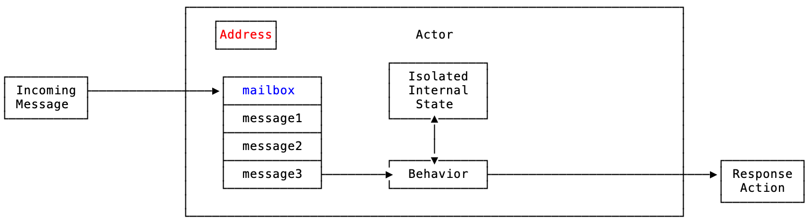
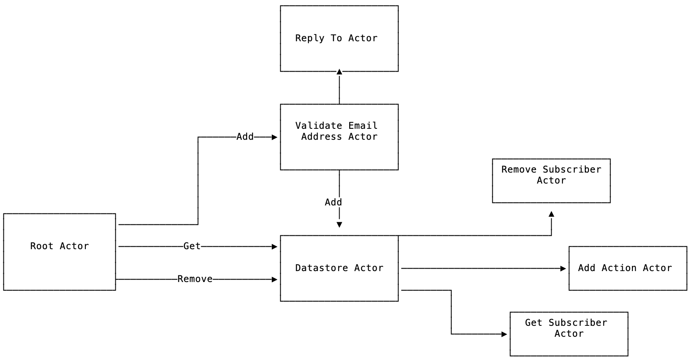
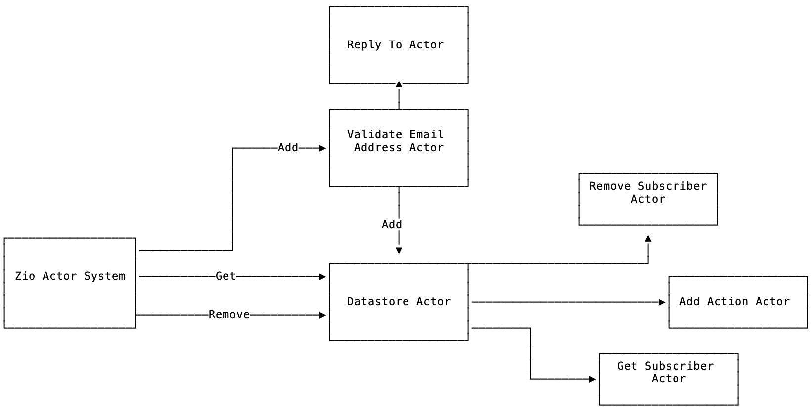
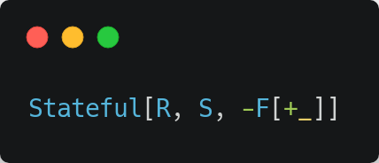
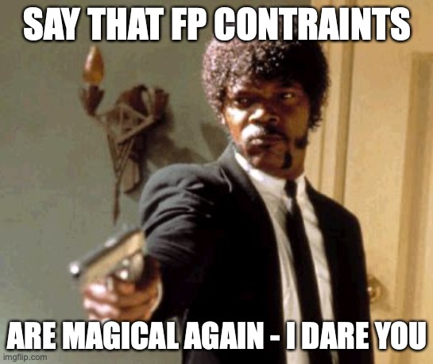

autoscale: true
slidenumbers: true
build-lists: true
footer: Scale By The Bay 2020 - Acting Lessons for Scala engineers with AKKA and ZIO by Salar Rahmanian<br>Follow me on Twitter: **@SalarRahmanian** - Blog: <https://www.softinio.com> - Twitch: **@softinio**<br><br><br>


# Acting Lessons for <br>Scala engineers with <br>AKKA and ZIO

[.hide-footer]

### By Salar Rahmanian

#### Follow me on Twitter: @SalarRahmanian - Blog: https://www.softinio.com

--- 

## Agenda

- About Salar Rahmanian
- Introduction to the Actor Model
- Akka
- ZIO-Actors
- Future is Bright ☀️☀️☀️


^- Going to talk about two implementations of the actor model, namely...akka ... zio-actors
- last I am going to wrap with why the future is bright for the actor model on the JVM with Scala

---

[.hide-footer]

## About Salar Rahmanian

- Also known as **softinio**
- Blog: **www.softinio.com**
- Twitter: **@SalarRahmanian**
- Stream on Twitch: **@softinio**
- Scala Engineer 
- Trying to learn & get better at Functional Programming!


---

[.hide-footer]

## Introduction to the Actor Model


^- my first computer was an IBM PC clone with Intel 486. It had a button called turbo that when pushed would double its clock speed.
- watching how software and hardware have evolved since then has been an interesting journey.
- When new faster hardware comes out, software quickly evolves to make use of all the new performance
- CPU's have evolved from it all being about their clock speed and cache to being more about number of cores and hyperthreading
- With moores law and this evolution we need to fully utilize the multiple cores and threads
- We need to leverage concurrency
- There are many methods and patterns for concurrency and in this talk our focus is on the actor model

---

## What is an Actor ? 



^- Consists of an isolated internal state, an address, a mailbox and a behavior
- address: Unique reference to locate the actor so that you can send a message to it
- once actor receives a message:
	- the message is added to the mailbox
	- actors mailbox is like a queue
	- order of the mailbox is not guaranteed though some implementations do give you choice of different kind of mailboxes which do
- Actors pick up one message at a time to process
- Behavior determines what the actor does with each message
- Once the actor has finished processing the message it will do one or more of the following:
	- Do nothing !
	- Send one or more messages to other actors
	- create a new actor and send a message to it
	- respond to the sender zero or more times
	- it may or may not update its internal state also

---

## Characteristics of an Actor

 

- Actors persist
- Actors have an isolated state
- 🦸‍♀️🦸‍♂️ Super powers for building concurrent applications 🦹‍♂️🦹‍♀️

^- actors persisting means once they are started they will keep running, processing messages from its mailbox
	- it maintains its internal state throughout
	- Only the actor has access to this state
	- this is unlike normal async programming like Futures in scala where once the call is finished it stops and its state between calls is not maintained
- These characteristics gives us Super powers for building concurrent applications

---

[.hide-footer]

## Handling Failure with Actors


^- Every Actor has a supervisor whose sole job is to know how to handle a failure
- the supervisor itself is an actor
- different libraries and frameworks provide you with a choice of supervisors that you can use to handle failures
- You will always have the opportunity to create your own custom supervisors

---

## akka


- Akka is a toolkit for building highly concurrent, distributed, and resilient message-driven applications for Java and Scala
- Implements the Actor Model
- Inspiration from Erlang
- Recently introduced Typed Actors (now the default)

---

## Example Application using akka and Scala



^- Contrived example
- Simple mailing list app
	- add a persons name and email address to  a datastore
	- remove the person from datastore
	- retrieve person from datastore
- as this is a contrived example, the datastore is contrived also. we will actually just log a message for that action
- `Root Actor`: Creates the actor system and spawns all the actors.
- `Validate Email Address Actor`: Validates if the new message received has a valid email address
- `Datastore Actor`: decides whether we are doing an Add, Get or a Remove and calls the relevant actor with the message.
- `Add Action Actor`: Uses the message received to add the received subscriber to the database.
- `Get Subscriber Actor`: Retrieves a subscriber from the database.
- `Remove Subscriber Actor`: Removes a subscriber from the database.
- `Reply To Actor`: Responsible letting original caller know we accepted the new customer to store

---

## Message Types used in our akka app

### Command

Our actors will be sending 3 types of commands to determine whether we are adding, removing or fetching a person

```scala
sealed trait Command
final case object Add extends Command
final case object Remove extends Command
final case object Get extends Command
```
^- Lets now look at the types of messages our actors are going to be communicating with
- read
- So we have a sum type which caters for each of the possible commands

---

## Message Types used in our akka app

### Customer

Message type received by root actor for adding a person

```scala
final case class Customer(
	firstName: String, 
	lastName: String, 
	emailAddress: String
)
```

---

## Message Types used in our akka app

### Message

Message sent by root actor to add a new subscriber

[.code-highlight: 1, 5-10]

```scala
final case class Message(
    firstName: String,
    lastName: String,
    emailAddress: String,
    command: Command,
    db: ActorRef[Message],
    replyTo: ActorRef[SubscribedMessage]
) {
  def isValid: Boolean = EmailValidator.getInstance().isValid(emailAddress)
}
```
^- read
- it contains the information that our Customer type had, but in addition 
- it has a command field to determine whether we are adding, removing or fetching.
- it has a ActorRef for the datastore actor, so it knows which actor that was spawned it should send the message to for storing
- it has an ActorRef for the reply to actor to send a message to once the received message has been accepted to be saved
- a also has a helper method to make sure received message has a valid email address
- Note that the ActorRef I am referring to is the actors address that I mentioned

---

## Message Types used in our akka app

### Subscribed Message

Message type sent to replyTo actor to confirm we are storing the customer.

```scala
final case class SubscribedMessage(
	subscriberId: Long, 
	from: ActorRef[Message]
)
```

^- unique id of the item being added
- ActorRef of actor that sent the request
- NEXT:  Lets look at how we would implement our first actor, 

---

## Validate Email Address Actor (akka)

```scala
object Subscriber {
  def apply(): Behavior[Message] = Behaviors.receive { (context, message) =>
    context.log.info(s"Validating ${message.firstName} ${message.lastName} with email ${message.emailAddress}!")
    if (message.isValid) {
      message.replyTo ! SubscribedMessage(1L, context.self)
      message.db ! message
    } else {
      context.log.info(s"Received an invalid message $message.emailAddress")
    }
    Behaviors.same
  }
}
```

^- When creating an actor we need to define how the actor reacts to messages and how they are processed
- taking a look at the apply method of my code snippet you can see that to do that We create a `Behavior` of type `Message` which is the type of the message the actor will receive
- Behaviors.receive provides us with a context and the received message
- we use the context to log messages
- message.isValid is called to determine if the received message has a valid email address
- if not valid an error message is logged using the context
- if valid:
	- a message is send to the replyTo actor to confirm acceptance of the received message for adding
	- a message is sent to the datastore actor that will save the message
- Last we need to signal whether our actors internal state will change before the next message is processed. In this example its internal state does not change, so we return with `Behaviors.same` to show this

---

## Datastore Actor (akka)

```scala
object Datastore {
  def apply(): Behavior[Message] = Behaviors.receive { (context, message) =>
    context.log.info(s"Adding ${message.firstName} ${message.lastName} with email ${message.emailAddress}!")
    message.command match {
      case Add => println(s"Adding message with email: ${message.emailAddress}") // Send message to Add Action Actor
      case Remove => println(s"Removing message with email: ${message.emailAddress}") // Send message to Remove Subscriber Actor
      case Get => println(s"Getting message with email: ${message.emailAddress}") // Send message to Get Subscriber Actor
    }
    Behaviors.same
  }
}
```

^- Similar to the earlier actor we receive a context and the message. The context used for logging
- we pattern match on the messages command field to determine the relevant datastore operation of Add, Remove or Get and call the relevant actor to carry out the operation
- as this is a contrivied example we are just logging what action is being taken here
- Again as this actor doesn't need to change its internal state between calls a `Behaviors.same` is returned


---

## Root Actor (akka)

[.code-highlight: 1-14]

```scala
object ActorsMain {
  def apply(): Behavior[Customer] =
    Behaviors.setup { context =>
      val subscriber = context.spawn(Subscriber(), "subscriber")
      val db = context.spawn(Datastore(), "db")

      Behaviors.receiveMessage { message =>
      	val replyTo = context.spawn(Reply(), "reply")
        subscriber ! Message(message.firstName,message.lastName,message.emailAddress,Add,db,replyTo)
        Behaviors.same
      }
    }
}

object Pat extends App {
  val actorsMain: ActorSystem[Customer] = ActorSystem(ActorsMain(), "PatSystem")
  actorsMain ! Customer("Salar", "Rahmanian", "code@softinio.com")
}
```

^- The root actor spawns all new actors and as a result has the ActorRef for all the actors
- going through the code snippet you can see:
	- we are creating a behavior of type Customer, as that is the type of messages we will be receiving
	- As this is the outer most actor in our actor hierachy, Behaviors.setup is used to spawn all the actors we have
	- When a new message is received a message is sent to the  subscriber actor which is our validate email address actor we discussed

---

[.code-highlight: 15-20]

```scala
object ActorsMain {
  def apply(): Behavior[Customer] =
    Behaviors.setup { context =>
      val subscriber = context.spawn(Subscriber(), "subscriber")
      val db = context.spawn(Datastore(), "db")

      Behaviors.receiveMessage { message =>
      	val replyTo = context.spawn(Reply(), "reply")
        subscriber ! Message(message.firstName,message.lastName,message.emailAddress,Add,db,replyTo)
        Behaviors.same
      }
    }
}

object Pat extends App {
  val actorsMain: ActorSystem[Customer] = ActorSystem(ActorsMain(), "PatSystem")
  actorsMain ! Customer("Salar", "Rahmanian", "code@softinio.com")
}
```
^- In your applications main you create the ActorSystem and start sending customer messages
- code snippet self explanatory

---

## ZIO Actors


- a high-performance, purely-functional library for building, composing, and supervising typed actors 
- backed by ZIO and Scala
- Models actor's communication without side effects
- Everything Typed

^- lets now take a look at ZIO Actors another implementation of the Actor model

---

## Example App using ZIO Actors & Scala



^- we are going to go through the same contrived example that went through with Akka but this time using zio-actors

---

## Message Types used in our ZIO app

### Command

Our actors will be sending 3 types of commands to determine whether we are adding, removing or fetching a person

```scala
sealed trait Command
final case object Add extends Command
final case object Remove extends Command
final case object Get extends Command
```

^- starting of with a review of the message types our actors are going to be communicating with
- we have same Command type to know whether we are adding, removing or fetching a person

---

## Message Types used in our ZIO app

### Protocol

```scala
sealed trait Protocol[+A]
```
^- we define the protocol type whose child types will be the different types our actors will be using to run behaviors on and do any processing on

---

## Message Types used in our ZIO app

### Customer

```scala
final case class Customer(
    firstName: String,
    lastName: String,
    emailAddress: String
) extends Protocol[Unit]
```

^- the customer type is the same as what we had with the akka application except it is now a child type of the protocol type we have

---

## Message Types used in our ZIO app

### Message

[.code-highlight: 1, 5-11]

```scala
final case class Message(
    firstName: String,
    lastName: String,
    emailAddress: String,
    command: Command,
    db: ActorRef[Protocol],
    replyTo: ActorRef[Protocol]
) extends Protocol[Unit] {
  def isValid: UIO[Boolean] =
    UIO(EmailValidator.getInstance().isValid(emailAddress))
}
```

^- The message type is the same as what we used for the akka app with one exception
- notice that the isValid helper now returns a UIO[Boolean] instead of a Boolean
- UIO is an effect type from ZIO
- we will talk about UIO later

---

## Message Types used in our ZIO app

### SubscribedMessage

```scala
final case class SubscribedMessage(
	subscriberId: Long, from: ActorRef[Protocol]
) extends Protocol[Unit]
```

---

## Message Types used in our ZIO app

### InvalidEmailException

```scala
case class InvalidEmailException(
	msg: String
) extends Throwable
```

^- with ZIO Actors we define a specific type for failures will talk more about this in a later slide

---

## ZIO

[.column]

```scala
ZIO[R, E, A]   
```

[.column]

- `R` - Environment type
- `E` - Failure type
- `A` - Success 

^- I don't have time in this presentation to go over ZIO in detail,  
- Just a quick summary of what a ZIO effect type 

---

## ZIO

Some ZIO Type aliases

```scala
UIO[A] is ZIO[Any, Nothing, A]
RIO[R,A] is ZIO[R, Throwable, A]
```

^- ZIO provides us with some type aliases
- going to go through two of them as I will be using them in this presentation
- UIO is a ZIO effect that can have any environment and will never fail
- RIO is a ZIO effect that will require an environment, can fail with a throwable or can succeed with A 

---

## Implementing a behavior with ZIO Actors



- `R` represents the environment type (similar to `R` in `ZIO[R, E, A]`)
- `S` represents the state of the actor that gets updated after every message. 
- `F` represents the message the actor will receive to process.

^- When creating actors we need to define how the actor reacts to messages and how it process them
- with zio actors to create a behvior we need to create a Stateful

---

### Validate Email Address Actor (ZIO)

```scala
  val subscriber = new Stateful[Console, Unit, Protocol] {
    override def receive[A](
        state: Unit,
        protocol: Protocol[A],
        context: Context
    ): RIO[Console, (Unit, A)] =
      protocol match {
        case message: Message =>
          for {
            _ <- putStrLn(
              s"Validating ${message.firstName} ${message.lastName} with email ${message.emailAddress}!"
            )
            valid <- message.isValid
            self <- context.self[Protocol]
            _ <- message.replyTo ! SubscribedMessage(1L, self)
                 if (valid)
            _ <- message.db ! message
                 if (valid)
          } yield ((), ())
        case _ => IO.fail(InvalidEmailException("Failed"))
      }
  }
```

^- so lets now implement our first actor behavior with zio actors

---

[.code-highlight: 1]

```scala
  val subscriber = new Stateful[Console, Unit, Protocol] {
    override def receive[A](
        state: Unit,
        protocol: Protocol[A],
        context: Context
    ): RIO[Console, (Unit, A)] =
      protocol match {
        case message: Message =>
          for {
            _ <- putStrLn(
              s"Validating ${message.firstName} ${message.lastName} with email ${message.emailAddress}!"
            )
            valid <- message.isValid
            self <- context.self[Protocol]
            _ <- message.replyTo ! SubscribedMessage(1L, self)
                 if (valid)
            _ <- message.db ! message
                 if (valid)
          } yield ((), ())
        case _ => IO.fail(InvalidEmailException("Failed"))
      }
  }
```

^- we start by creating a new Stateful
- For the `R` environment type we are passing a Console. Console is an environment type provided by ZIO. As this is a contrived example we use this environment to log messages.
- State of the actor does not change between messages processed hence the state which is the S is Unit
- protocol which is the `F` is the type of messages our actor is able to process

---

[.code-highlight: 2, 7-23]

```scala
  val subscriber = new Stateful[Console, Unit, Protocol] {
    override def receive[A](
        state: Unit,
        protocol: Protocol[A],
        context: Context
    ): RIO[Console, (Unit, A)] =
      protocol match {
        case message: Message =>
          for {
            _ <- putStrLn(
              s"Validating ${message.firstName} ${message.lastName} with email ${message.emailAddress}!"
            )
            valid <- message.isValid
            self <- context.self[Protocol]
            _ <- message.replyTo ! SubscribedMessage(1L, self)
                 if (valid)
            _ <- message.db ! message
                 if (valid)
          } yield ((), ())
        case _ => IO.fail(InvalidEmailException("Failed"))
      }
  }
```

^- to implement the behavior we pattern match on the protocol to make sure we have a message of the correct type
- For a valid message we:
	- print to the console that we are validating
	- check if email address is valid by using the helper method our message type provided
	- if valid continue
	- get the actorref of the current actor from the context
	- use the actorref to create a SubscribedMessage and send to the replyTo actor
	- send the received message to the datastore actor to save the message
	- if the message received is of an invalid type then fail by using IO.fail and the failure type we had defined. IO.fail is provided by ZIO for us
	- Interesting thing to note here is that as everything here are all ZIO effects we can use a for comprehension to compose our flow

---

[.code-highlight: 6]

```scala
  val subscriber = new Stateful[Console, Unit, Protocol] {
    override def receive[A](
        state: Unit,
        protocol: Protocol[A],
        context: Context
    ): RIO[Console, (Unit, A)] =    <-- SAME AS ZIO[Console, Throwable, (Unit, A)]
      protocol match {
        case message: Message =>
          for {
            _ <- putStrLn(
              s"Validating ${message.firstName} ${message.lastName} with email ${message.emailAddress}!"
            )
            valid <- message.isValid
            self <- context.self[Protocol]
            _ <- message.replyTo ! SubscribedMessage(1L, self)
            if (valid)
            _ <- message.db ! message
            if (valid)
          } yield ((), ())
        case _ => IO.fail(InvalidEmailException("Failed"))
      }
  }
```

^- This actor returns an RIO which is an alias to a ZIO effect
- has a Console environment type

---

[.code-highlight: 6, 19]

```scala
  val subscriber = new Stateful[Console, Unit, Protocol] {
    override def receive[A](
        state: Unit,
        protocol: Protocol[A],
        context: Context
    ): RIO[Console, (Unit, A)] =    <-- SAME AS ZIO[Console, Throwable, (Unit, A)]
      protocol match {
        case message: Message =>
          for {
            _ <- putStrLn(
              s"Validating ${message.firstName} ${message.lastName} with email ${message.emailAddress}!"
            )
            valid <- message.isValid
            self <- context.self[Protocol]
            _ <- message.replyTo ! SubscribedMessage(1L, self)
            if (valid)
            _ <- message.db ! message
            if (valid)
          } yield ((), ())
        case _ => IO.fail(InvalidEmailException("Failed"))
      }
  }
```

^- a tuple for success

---

[.code-highlight: 6,20]

```scala
  val subscriber = new Stateful[Console, Unit, Protocol] {
    override def receive[A](
        state: Unit,
        protocol: Protocol[A],
        context: Context
    ): RIO[Console, (Unit, A)] =    <-- SAME AS ZIO[Console, Throwable, (Unit, A)]
      protocol match {
        case message: Message =>
          for {
            _ <- putStrLn(
              s"Validating ${message.firstName} ${message.lastName} with email ${message.emailAddress}!"
            )
            valid <- message.isValid
            self <- context.self[Protocol]
            _ <- message.replyTo ! SubscribedMessage(1L, self)
            if (valid)
            _ <- message.db ! message
            if (valid)
          } yield ((), ())
        case _ => IO.fail(InvalidEmailException("Failed"))
      }
  }
```

^- And for a failure we do an IO.fail to return the failure type

---

## Magical Functional Programming



```scala
ZIO[Console, Throwable, (Unit, A)]
```

				▲
				║
				║
				║
				║
				║
				║
				║


__ZIO will force you down the right path !__

^- This illustrates one of the magical powers of functional programming were the error channel in ZIO expects a throwable so this constraints forces you as a developer to create the correct type to return on a failure
- This is why we created the `InvalidEmailException` type

---

### Datastore Actor (ZIO)

```scala
  val datastore = new Stateful[Console, Unit, Protocol] {
    override def receive[A](
        state: Unit,
        protocol: Protocol[A],
        context: Context
    ): RIO[Console, (Unit, A)] =
      protocol match {
        case message: Message =>
          for {
            _ <- putStrLn(s"Processing Command")
            _ <- message.command match {
              case Add =>
                putStrLn(s"Adding message with email: ${message.emailAddress}")
              case Remove =>
                putStrLn(
                  s"Removing message with email: ${message.emailAddress}"
                )
              case Get =>
                putStrLn(s"Getting message with email: ${message.emailAddress}")
            }
          } yield ((), ())
        case _ => IO.fail(InvalidEmailException("Failed"))
      }
  }
```

^- now we implement the datastore actor
- similarly, we define a StateFul
- we pattern match to make sure we have a valid message
- if not we return a IO.fail to indicate a failure

---

[.code-highlight: 11-20]

```scala
  val datastore = new Stateful[Console, Unit, Protocol] {
    override def receive[A](
        state: Unit,
        protocol: Protocol[A],
        context: Context
    ): RIO[Console, (Unit, A)] =
      protocol match {
        case message: Message =>
          for {
            _ <- putStrLn(s"Processing Command")
            _ <- message.command match {
              case Add =>
                putStrLn(s"Adding message with email: ${message.emailAddress}")
              case Remove =>
                putStrLn(
                  s"Removing message with email: ${message.emailAddress}"
                )
              case Get =>
                putStrLn(s"Getting message with email: ${message.emailAddress}")
            }
          } yield ((), ())
        case _ => IO.fail(InvalidEmailException("Failed"))
      }
  }
```

^- if the message is valid, we do another pattern match, this time on the command received to determine whether we are doing an Add, Remove or a Get.Depending on which the message is sent to the relevant actor


---

### ZIO Actor System

[.code-highlight: 2]

```scala
  val program = for {
    actorSystemRoot <- ActorSystem("salarTestActorSystem")
    subscriberActor <- actorSystemRoot.make("subscriberActor", Supervisor.none, (), subscriber)
    datastoreActor  <- actorSystemRoot.make("datastoreActor", Supervisor.none, (), datastore)
    replyActor      <- actorSystemRoot.make("replyActor", Supervisor.none, (), reply)
    _               <- subscriberActor ! Message(
					      "Salar",
					      "Rahmanian",
					      "code@softinio.com",
					      Add,
					      datastoreActor,
					      replyActor
					    )
    _               <- zio.clock.sleep(Duration.Infinity)
  } yield ()
```

^- Now lets look at how we create our actor system
- with zio actors everything is a ZIO effect, hence we can use a for comprehension
- and we start by creating the actorsystem

---

[.code-highlight: 3-5]

```scala
  val program = for {
    actorSystemRoot <- ActorSystem("salarTestActorSystem")
    subscriberActor <- actorSystemRoot.make("subscriberActor", Supervisor.none, (), subscriber)
    datastoreActor  <- actorSystemRoot.make("datastoreActor", Supervisor.none, (), datastore)
    replyActor      <- actorSystemRoot.make("replyActor", Supervisor.none, (), reply)
    _               <- subscriberActor ! Message(
					      "Salar",
					      "Rahmanian",
					      "code@softinio.com",
					      Add,
					      datastoreActor,
					      replyActor
					    )
    _               <- zio.clock.sleep(Duration.Infinity)
  } yield ()
```

^- Using the actor system created, we use its .make property to create all our actors

---


[.code-highlight: 6-13]

```scala
  val program = for {
    actorSystemRoot <- ActorSystem("salarTestActorSystem")
    subscriberActor <- actorSystemRoot.make("subscriberActor", Supervisor.none, (), subscriber)
    datastoreActor  <- actorSystemRoot.make("datastoreActor", Supervisor.none, (), datastore)
    replyActor      <- actorSystemRoot.make("replyActor", Supervisor.none, (), reply)
    _               <- subscriberActor ! Message(
					      "Salar",
					      "Rahmanian",
					      "code@softinio.com",
					      Add,
					      datastoreActor,
					      replyActor
					    )
    _               <- zio.clock.sleep(Duration.Infinity)
  } yield ()
```

^- Then we send our message to Add a customer to our subscriber actor, with an ActorRef for the replyActor and an ActorRef for the datastoreStoreActor for it to use

---

### akka and ZIO Actors feature comparison

| Feature | akka | ZIO Actors |
| --- | --- | --- |
| Typed | ✅ | ✅ |
| No side effects | ❌ | ✅ |
| Supervisor | ✅ | ✅ |
| Persistance | ✅ | ✅ |
| Remoting | ✅ | ✅ |
| Diagnostics/Monitoring/Metrics | Lightbend Telemetry | zio-zmx + Promestheus |
| Receptionist | ✅ | WIP |
| Clustering/Distributed/Sharding | ✅ | WIP |

^- now that we have looked at both akka and ZIO Actors lets do a quick comparison of the two
- this comparison is not an exhaustive list
- of course akka being a more mature project does currently offer more choice in some of these features  and more features
- such as for persistance akka gives you options for multiple types of datastores to use whereas zio-actors today only supports JDBC
- for Monitoring akka has lightbend telemetry which is excellent but to get it you will need a lightbend subscription
	- for zio-actors you have zio-zmx which is available as a open source project as part of the ZIO eco system

---

### akka and ZIO Actors feature comparison

| Feature | akka | ZIO Actors |
| --- | --- | --- |
| Java 8 | ✅ | ✅ |
| Java 11 | ✅ | ✅ |
| Scala 2.11 | ✅ | ✅ |
| Scala 2.12 | ✅ | ✅ |
| Scala 2.13 | ✅ | ✅ |
| Scala 3 | ? | ✅ |
| scala.js | ❌ | ✅ (next release)|
| scala native | ❌ | Evaluating |

^- Both support JDK8 and 11. Will probably work with newer JDK I just have not tried.
- Both support scala versions 2.11.x, 2.12.x and 2.13.x
- zio-actors has been tested and works with dotty so will support scala3
- I am pretty sure akka will be supporting scala3 also but I couldn't find any information on it hence the question mark.
- scala.js as far as I know akka does not support it. zio-actors will be next release. PR adding the functionality is being reviewed.

---

[.hide-footer]

### ☀️☀️☀️ Future is Bright for the Actor model with Scala ☀️☀️☀️


- ZIO Actors has Interop with akka 🎊🎉🍾
- **YES YES** this means ability to send and receive messages between zio actors and akka typed actors!!!

^- Future is Bright for the Actor model with Scala
- We have two great implementations
- and the icing on the cake is ....

---

[.build-lists: false]

## Resources

- My Sample Application used in this post: <https://github.com/softinio/pat>
- My Blog: <https://www.softinio.com>
- Akka Documentation: <https://akka.io/docs/>
- ZIO Actors Documentation <https://zio.github.io/zio-actors/>
- ZIO Documentation: <https://zio.dev>
- ZIO / ZIO Actors Discord: <http://sca.la/ziodiscord>

^- now to wrap up some resources
- my sample app that contains the snippets from this presentation will be available on github by end of the week. Think of it as the hello world for the actor model using scala
- over the next few months my goal is to blog about akka and zio-actors in more details so please follow my blog and give me feedback

---

[.hide-footer]
[.build-lists: false]


## Contribute to <br> ZIO Actors


- Repo: <https://github.com/zio/zio-actors>
- **#zio-actors** channel on ZIO Discord: <br> <http://sca.la/ziodiscord>
- First time contributors welcome and we will help!
- Look at Issues tab on GitHub

^- I would love to see more people contribute to zio-actors so visit the repo on github
- take a look at the issues and see if there is one you want to work on
- do open new issues for any feature you would like to see added to zio-actors
- Don't hesitate to join the zio discord and visit the zio-actors channel if you need any help whether as a user or a contributor.

---

[.hide-footer]

# Thank you

#### Follow me on Twitter: @SalarRahmanian - Blog: https://www.softinio.com
#### Follow my stream on Twitch: https://www.twitch.tv/softinio

^- wanted to thank everyone for attending my talk
- want to thank Alexy Khrabrov for inviting me to do a talk at this fabulous conference


