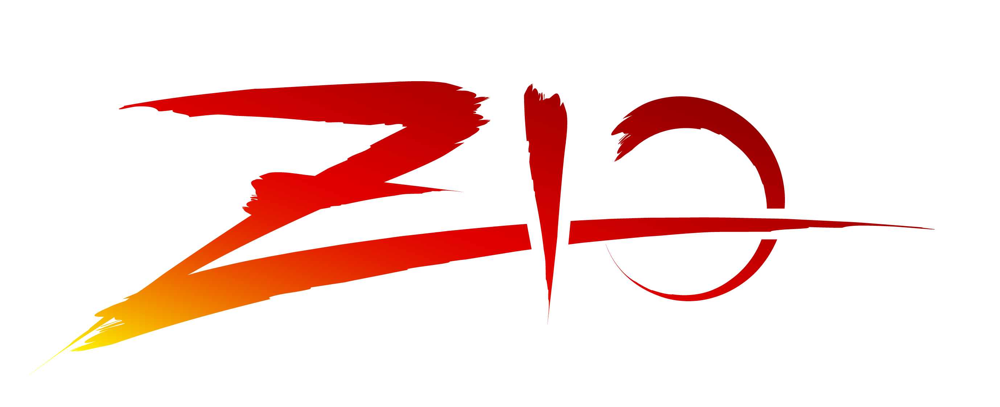
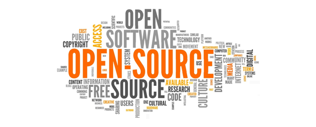
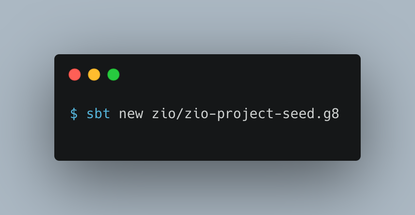
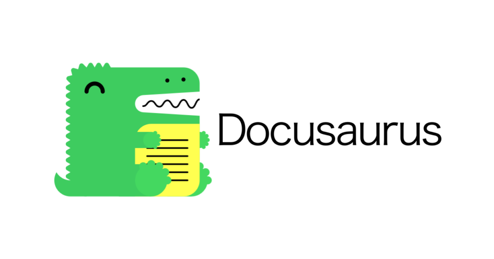

autoscale: true
slidenumbers: true
build-lists: true
footer: LambdaConf 2020 - Lessons learnt from being a ZIO contributor by Salar Rahmanian Follow me on Twitter: @SalarRahmanian - Blog: https://www.softinio.com

# Lessons learnt from being a ZIO contributor #

--- 

### You won't learn about MONAD's

- About Salar Rahmanian
- My journey to being an open source contributor with ZIO
- How you can be a ZIO Contributor
- Lessons Learnt

---

## About Salar Rahmanian

- Also known as **_softinio_**
- Blog: **_https://www.softinio.com_**
- Twitter: **_@SalarRahmanian_**

---

## What have I been up to

- I like to drink wine 🍷
- Pascal, Fortran, C (University)
- C Programmer on Unix & Vax VMS
- Java
- Python
- Scala
- Trying to get good at Functional Programming
- Early contributor to ZIO and related projects

^- I started life at university and left knowing c
- this lead me to a c programming career working with big enterprise corporations such Mobile networks
- Kind of company that was not built on open source software they would have paid $$$$ for an oracle license & Support contracts mattered to them
- Did as I was told by enterprise world so moved on to learning and using Java with Spring and Hibernate eventually
- After a few years of that Python and got excited that I can write pseudo code for work and get paid. Easy to run, and i get to type a lot less. So I went off to do that
- joint a new company as python developer but within 3 months I was moved to a new team to build a data ingestion pipeline. I chose Scala & Akka for this and my journey of Scala began
- Had no mentor so wrote some idiomatic java scala

---

[.build-lists: false]
## 	Community & Meetup's

- San Francisco Scala Meetup (**_<http://sfscala.org>_**)
- Scala Bay (Silicon Valley) Meetup (**_<https://www.meetup.com/Scala-Bay/>_**)
- San Francisco Java User Group Meetup (**_<http://www.sfjava.org>_**)
- San Francisco Elastic User Group (**_<https://www.meetup.com/Elasticsearch-San-Francisco>_**)
- Bay Area Nix/NixOS User Group (**_<https://www.meetup.com/Bay-Area-Nix-NixOS-User-Group/>_**)
- SF Spark and Friends (**_<https://www.meetup.com/SF-Spark-and-Friends/>_**)
- Bay Area AI (**_<https://www.meetup.com/bay-area-ai/>_**)
- GraphQL By the Bay (**_<https://www.meetup.com/graphql-by-the-bay>_**)

###### Community Slack and Discord: **_<https://www.sfbayareatechies.com>_**)

###### For announcements and something new being launched later this year follow me on twitter: **_@SalarRahmanian_**

^next sfscala event tomorrow, visit sfscala.org for details

---

## Open Source

^- Culture shock
- Searched for a project to contribute to 
- asked questions and got no replies
- Picked issues and got zero help when I had questions
- a lot of conversation amongst themselves but no time for the new contributor
- Saw someone advertising on reddit that they are looking for someone to maintain their project
- I offered to help was kind of shot down by someone who wasn't even part of the project
- End conclusion - contributing to open source is hard!

---

## How ZIO started

^ - John De Goes posts on Twitter asking for 5 contributors for a new project
- 300 expressed an interest
- John sets up a few session to talk through project and gave interests and experience of applicants
- we split into groups based on interest
- Everyone started contributing with the help of John for guidance and amongst themselves within their group.
- Level of contribution was different between each person, and some did drop out and didn't make any contributions

---

[.build-lists: false]
# Contribute to ZIO

- ZIO is a library for asynchronous and concurrent programming that is based on pure functional programming for the Scala programming language.
- Core ZIO Library
- Multiple associated projects which either enhance ZIO features or use ZIO to solve a technical problem
- Have a complete solution using ZIO

^- core lib attracts most contributors
- Velocity fast
- I used to be able to keep up with reviewing all PRs. No more!
- Do a quick overview of type of other projects we have: zio-redis, zio-nio, zio-actors, zio-config

---

## Choosing a ZIO Project to contribute too ##

- Visit our organization on GitHub: **_<https://github.com/zio>_**
- Review each projects README and Issue Tracker
- Look for issues labeled `good first issue` or `documentation`
- Look for new projects
- Low activity projects
- Projects discord channel 

^- Every project have their goals written on README of what they are solving
- Good place to start is by doing a few PRs that are low hanging fruit
- Getting a few PRs done even if it is docs will get you familiar with contributing and help you get known by other contributors
- doing documentation as well as code familiarization gets you to meet other contributors and strick up a relationship
- Something you can build on
- Mention benefits of new projects
- Mention benefits of low active projects and why they may be low active
- Get help in projects discord that you are interested on where to start or to get more info

---

## Starting a new ZIO Project ##

- Contribute a new project to the ZIO eco-system
- Giter8 project seed
	- Code structure
	- Build process and CI
	- Base dependencies and sbt plugins
	- Microsite included !

^- You have an idea for lib that would be useful to ZIO ecosystem
- Just minor tokens and GitHub and CI settings to be applied and you are live

---

## Your new ZIO Project

| ZIO Project| Community Project |
| --- | --- |
| ZIO Org on GitHub | Own Org on GitHub |
| ZIO Org on Maven | Own Org on Maven |
| ZIO Discord Channel | Community Discord Channel[^1] |

[^1]: By invitation only, reviewed on a cases by case only. 

^- two choices of how you start a project
- Community project - your own github/maven org
- still can use discord to get help
- once project established we would consider adding a channel for you under the community project section of discord
- we have had projects start as community then move to zio org
- joining the zio org benefits: increased adoption, increased awareness and more contributors
- use the seed in case you do move later

---

## Devops, infrastructure & Builds Lair ##

- JDK Supported:  **Java 8** , **Java 11**
- Scala Versions Supported: **2.12.x** , **2.13.x** & **Dotty**
- Optional support for Scala **2.11.x**
- `CircleCI` used for all project builds
	- Plan to migrate to GitHub Actions soon
- All repos on merge to master create a snapshot maven release
- Official Releases use semver versioning and GitHub Release tagging
- Official releases only result in the microsite to be updated
- To get help ask in **`#devops-lair`** channel on ZIO Discord (**_<http://sca.la/ziodiscord>_**)

^- See releases top on repo github for release notes
- README does have latest release version and snapshot versions listed as a shield

---

## Documentation microsite ##

- Scalameta mdoc (**_<https://scalameta.org/mdoc/>_**) inconjunction with Docusaurus (**_<https://docusaurus.io/>_**) 
- Core ZIO Library microsite deploys to **_<https://zio.dev>_**
- All other projects deploy to GitHub pages: **_<https://zio.github.io/zio-[project]/>_**

^- Planned adhoc microsite releases

---

## Contribution Etiquette and Collaboration ##

^- Compare with collaborating at work and how different it is
- everyone a volunteer
- be patient and grateful for their help
- Do's and Don't

---

## Working on an issue ##

^- check issue to see if anyone working on it
- if not comment that you want to work on it
- if someone is working on and is a recent comment move on to another issue
- if no activity in a long time ask if it is still being worked on
- give example of clash
- sometimes two people do end up working on same issue
- ask on discord to help with issue choice

---

## Pull Requests ##

^- maintainers do regularly review
- speak in discord channels
- compare maintainers with leads

---

## Learning and Getting Help ##

- GitHub issues
- GitHub Pull Requests
- Discord
	- #zio-users
	- #zio-contributors
	- Each other project have their own channel

^- Being a ZIO contributor is an opportunity to learn and practice. When trying to contribute don't hesitate to ask for help. All of us who have been contributing to ZIO for a while strive because we are happy to help each other and learn from each other.
- When picking up an issue to work on and have any questions, ask by commenting on it or go to the projects discord channel and have a discussion about any topic that you need help with. 
- We try to be a very welcoming and helpful community so we look forward to helping you succeed at contributing. 

---

## Additional Resources to help contributors ##

- ZIO Contributor Guidelines - https://zio.dev/docs/about/about_contributing
- ZIO Coding Guidelines - https://zio.dev/docs/about/about_coding_guidelines
- ZIO Code of Conduct - https://zio.dev/docs/about/about_coc

---

## Projects I am looking for Contributors for ##

^- Even though I do contribute to ZIO and help with the overall organizations builds and infrastructure I have been concentrating on two projects so far

--- 

[.build-lists: false]
### ZIO Actors ###

- High-performance, purely-functional library for building and supervising typed actors backed by ZIO
- https://zio.github.io/zio-actors/

^- My first scala job I build a data ingestion pipeline using akka
- inspired me to want to have an implentation of the actor model using ZIO
- I use a project board to set a roadmap and vision for the projects future
- feel free to look to see if anything is appealing to you

---

[.build-lists: false]
### ZIO ZMX ###

- Monitoring, Metrics and Diagnostics for ZIO
- https://zio.github.io/zio-zmx/

^- Does have a project board too, but needs updating
- The diagram you see is actually out of date slightly as it doesn't take into account latest changes from contributors

---

## Learning Resources ##

- https://zio.dev/docs/resources/resources (Resources menu option at https://zio.dev)

- Training by https://ziverge.com/
- John A. De Goes Patreon membership: https://www.patreon.com/jdegoes

---

# Lessons Learnt #

- Anyone Can be a contributor
- Focus your library on satisfying user experience and their needs
- Power of the group
- ZIO Community is very welcoming and supportive
- Learn by helping others
- Learn and Gain Experience
- Make a of new friends all around the world
- Microsite CI build will always randomly fail when least expected 🤣

^- I used to think oss was for a small group of elite developers and not for regular developers. ZIO Community showed me anyone can take part
- do your best to figure out the answer to a problem you are working on, but be open to ask for help if you haven't figured it out and be amazed by what we can figure out together as a community
- Welcoming and Supportive which motivates me to want to contribute more

---

# Thank you #

^- Thank you to John A De Goes and Courtney for the inviting me to talk at Lambdaconf
- I will be publishing an associated blog related to this talk that will include my slides and link to recording when available 

